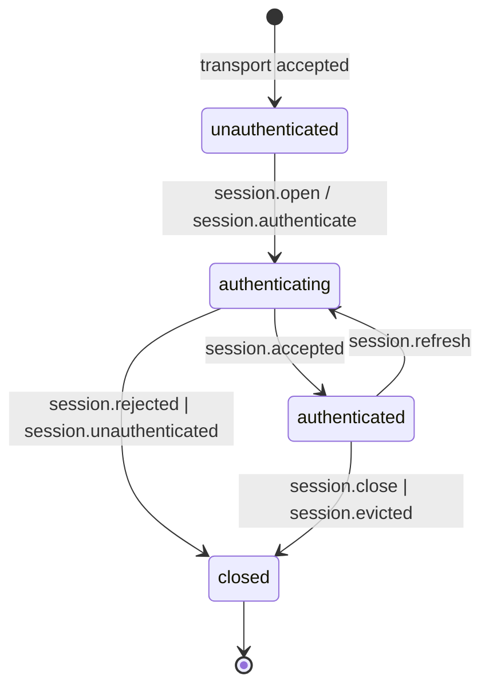
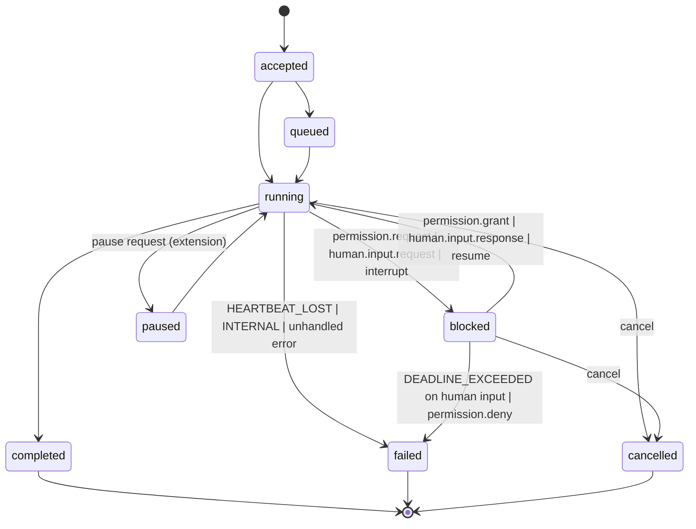
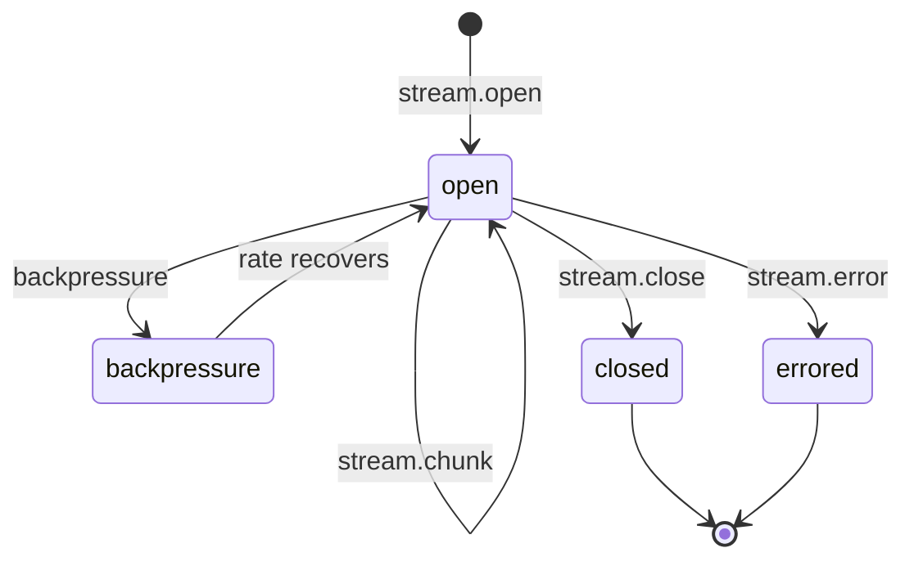
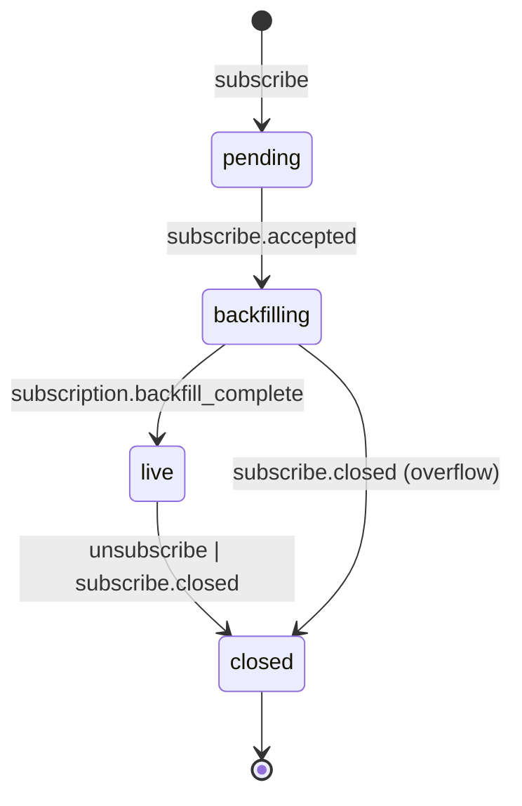
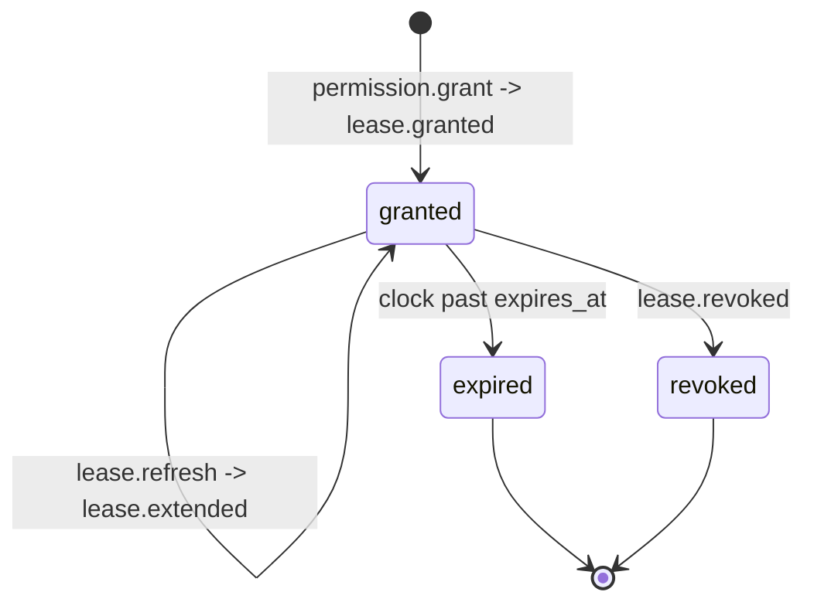

# PLAN.md — ARCP Go SDK v0.1

This document is the design ledger for the Go reference implementation of
ARCP v1.0 (RFC-0001-v2.md, copied into this directory verbatim). It is
written before Phase 1 begins and is updated at every phase gate. When the
RFC and this document disagree, the RFC wins; flag the conflict and fix the
document.

The module path is `github.com/fizzpop/arcp-go`. The Go toolchain floor is
1.24 (1.23 is the absolute floor — `iter.Seq2` requires it; we pin 1.24 to
get the matured iterator semantics and the cleaner range-over-func
compilation).

---

## 1. RFC Section Summaries (implementation-relevant)

**§4 Design principles.** Transport agnosticism (§4.1) is enforced by
keeping the wire format pure JSON envelopes and separating `transport.Transport`
from the runtime. Streaming-native (§4.2) drives the bounded-channel design
in `runtime/stream.go`. Authenticated by default (§4.6) means `none` auth
is rejected unless the `anonymous` capability is negotiated. Extensible
(§4.7) drives the namespacing and unknown-message handling in
`extensions.go`.

**§6.1 Envelope.** The canonical message container has ~17 fields, with
`arcp`, `id`, `type`, `timestamp`, and `payload` always required, and a
mix of conditional, recommended, and optional fields. We model this as a
single `arcp.Envelope` struct with a `Payload arcp.MessageType` interface
field; JSON dispatch is by the `type` field via a registry built up by
`init()` functions in each `messages/<group>.go` file. Snapshot tests with
golden JSON files lock the wire format.

**§6.4 Delivery semantics.** Two distinct keys: `id` (transport
idempotency) and `idempotency_key` (logical intent idempotency). We
enforce `id`-uniqueness in the SQLite event log via a unique constraint on
`(session_id, id)`; `INSERT OR IGNORE` lets retransmits be silently
deduped. `idempotency_key`-uniqueness is keyed on
`(session_principal, idempotency_key)` and lives in a separate table.

**§6.5 Priority and QoS.** Four levels (`low`, `normal`, `high`,
`critical`) with `normal` default. v0.1 honors priority only at the
inbound dispatch level (a single mutex'd priority queue draining into the
type-switch); per-stream/per-job ordering is preserved trivially because
each entity has its own goroutine reading its own channel. Fairness floors
deferred — `critical` is treated as a strict head-of-queue insertion only.

**§7 Capability negotiation.** Booleans are tri-state per RFC: missing
means `false`. We model `Capabilities` as an explicit struct with each
field being a `*bool` only where round-trip absence-vs-false matters
(it does for `extensions` and `binary_encoding`); for the boolean
features we use `bool` because `false` is the only unsupported state and
that matches the RFC's "absent ≡ false" rule.

**§8 Authentication.** Four-message handshake. v0.1 implements `bearer`,
`signed_jwt`, and `none` (anonymous). `mtls` and `oauth2` are deferred —
their handler stubs return `arcp.ErrUnimplemented` with the §8.2 reference.

**§9 Sessions.** Stateless and stateful in v0.1. Durable (across-reconnect
state and resume after process kill) is deferred; the in-process resume
support in Phase 5 covers reconnect within a single runtime process.

**§10 Jobs.** Eight states, three terminal. We implement the full state
machine with a typed `JobState` enum, an `errgroup`-supervised goroutine
per running job, and a watchdog using an injected `Clock` interface (so
heartbeat-lost detection is deterministic in tests). `interrupt` (§10.5)
emits `human.input.request` per the RFC's normative "SHOULD" guidance.
`job.schedule` (§10.6) returns `arcp.ErrUnimplemented` (§10.6 reference).

**§11 Streams.** Four kinds in v0.1: `text`, `event`, `log`, `thought`.
`binary` returns `arcp.ErrUnimplemented` only when the requested encoding
is `sidecar`; in-envelope base64 is supported per §11.3 first bullet.
Backpressure is `chan` capacity converted into explicit `backpressure`
envelopes when the channel is ≥ 80% full.

**§12 Human-in-the-loop.** Full `human.input.request/response`,
`human.choice.request/response`, `human.input.cancelled` with
`response_schema` validation (JSON Schema via
`santhosh-tekuri/jsonschema/v5`). Expiration with `default` synthesizes
a response with `responded_by: "default"`. Quorum policies are deferred
(first-response-wins only).

**§13 Subscriptions.** Filter dimensions: `session_id`, `trace_id`,
`job_id`, `stream_id`, `types`, `min_priority`. AND across fields, OR
within. Backfill from event log → synthetic
`subscription.backfill_complete` → live tail. Authorization for
cross-session subscription is restricted: a subscriber can only request
sessions they own (same principal). Cross-principal observation requires
a permission grant — deferred to v0.2.

**§15 Permissions / leases.** Full challenge → grant → lease.granted →
(refresh → lease.extended)* → revoke or expire flow. Lease store is
in-memory in v0.1 (lost across runtime restart); the SQLite-backed store
is straightforward to add later.

**§16 Artifacts.** Inline base64 only. SQLite blob storage with periodic
expiry sweep. `artifact.put` accepts data inline; `artifact.fetch`
returns inline data (no redirect URI). Sidecar binary frame artifacts
deferred.

**§17 Observability.** Logs go through `*slog.Logger`; trace_id/span_id
propagate via `context.Context` and a small `slog.Handler` wrapper that
lifts them onto every log record. Standard metric names (§17.3.1) are
defined as `const` strings in `messages/telemetry.go`.

**§18 Error model.** `arcp.ErrorCode` is a typed string with the full
canonical taxonomy as `const`. `arcp.Error` wraps `error` and exposes
`Code`, `Retryable`, `Details`. Sentinel errors
(`ErrUnauthenticated`, `ErrPermissionDenied`, `ErrLeaseExpired`,
`ErrLeaseRevoked`, `ErrUnimplemented`, `ErrDeadlineExceeded`) are
package-level `*arcp.Error` instances composed via the canonical codes,
so `errors.Is(err, arcp.ErrLeaseExpired)` works.

**§19 Resumability.** Message-id resume only. Client reconnects with the
same `session_id` and a `resume` envelope carrying `after_message_id`;
runtime replays from event log starting at the next message and then
joins live tail. Checkpoint-based resume deferred.

**§21 Extensions.** Namespaces validated against:
`^arcpx\.[a-z0-9-]+(\.[a-z0-9-]+)+\.v\d+$` or a reverse-DNS prefix
beginning with two domain labels and ending in `.v<n>`. The bare `x-`
prefix is reserved for transport-internal experiments and is rejected for
long-lived deployments. Unknown core-namespace types → `nack` with
`UNIMPLEMENTED`; unknown namespaced types with `extensions.optional:
true` → silent drop; otherwise → `nack` with `UNIMPLEMENTED`.

**§22 Transports.** WebSocket (via `github.com/coder/websocket`) and
stdio (newline-delimited JSON) are mandatory in v0.1. HTTP/2 and QUIC
are deferred. The internal `transport.Transport` interface is small
(`Send`, `Recv`, `Close`) so additional transports drop in cleanly.

---

## 2. Message Type Registry

Every protocol message type is mapped to its Go struct. The `init()`
function in each file registers the type with `arcp.RegisterMessageType`
keyed on the wire `type` string.

| Wire Type                          | Go Type                                | File                          |
| ---------------------------------- | -------------------------------------- | ----------------------------- |
| `session.open`                     | `messages.SessionOpen`                 | `messages/session.go`         |
| `session.challenge`                | `messages.SessionChallenge`            | `messages/session.go`         |
| `session.authenticate`             | `messages.SessionAuthenticate`         | `messages/session.go`         |
| `session.accepted`                 | `messages.SessionAccepted`             | `messages/session.go`         |
| `session.unauthenticated`          | `messages.SessionUnauthenticated`      | `messages/session.go`         |
| `session.rejected`                 | `messages.SessionRejected`             | `messages/session.go`         |
| `session.refresh`                  | `messages.SessionRefresh`              | `messages/session.go`         |
| `session.evicted`                  | `messages.SessionEvicted`              | `messages/session.go`         |
| `session.close`                    | `messages.SessionClose`                | `messages/session.go`         |
| `ping`                             | `messages.Ping`                        | `messages/control.go`         |
| `pong`                             | `messages.Pong`                        | `messages/control.go`         |
| `ack`                              | `messages.Ack`                         | `messages/control.go`         |
| `nack`                             | `messages.Nack`                        | `messages/control.go`         |
| `cancel`                           | `messages.Cancel`                      | `messages/control.go`         |
| `cancel.accepted`                  | `messages.CancelAccepted`              | `messages/control.go`         |
| `cancel.refused`                   | `messages.CancelRefused`               | `messages/control.go`         |
| `interrupt`                        | `messages.Interrupt`                   | `messages/control.go`         |
| `resume`                           | `messages.Resume`                      | `messages/control.go`         |
| `backpressure`                     | `messages.Backpressure`                | `messages/control.go`         |
| `checkpoint.create`                | `messages.CheckpointCreate`            | `messages/control.go`         |
| `checkpoint.restore`               | `messages.CheckpointRestore`           | `messages/control.go`         |
| `tool.invoke`                      | `messages.ToolInvoke`                  | `messages/execution.go`       |
| `tool.result`                      | `messages.ToolResult`                  | `messages/execution.go`       |
| `tool.error`                       | `messages.ToolError`                   | `messages/execution.go`       |
| `job.accepted`                     | `messages.JobAccepted`                 | `messages/execution.go`       |
| `job.started`                      | `messages.JobStarted`                  | `messages/execution.go`       |
| `job.progress`                     | `messages.JobProgress`                 | `messages/execution.go`       |
| `job.heartbeat`                    | `messages.JobHeartbeat`                | `messages/execution.go`       |
| `job.checkpoint`                   | `messages.JobCheckpoint`               | `messages/execution.go`       |
| `job.completed`                    | `messages.JobCompleted`                | `messages/execution.go`       |
| `job.failed`                       | `messages.JobFailed`                   | `messages/execution.go`       |
| `job.cancelled`                    | `messages.JobCancelled`                | `messages/execution.go`       |
| `job.schedule`                     | `messages.JobSchedule`                 | `messages/execution.go`       |
| `workflow.start`                   | `messages.WorkflowStart`               | `messages/execution.go`       |
| `workflow.complete`                | `messages.WorkflowComplete`            | `messages/execution.go`       |
| `agent.delegate`                   | `messages.AgentDelegate`               | `messages/execution.go`       |
| `agent.handoff`                    | `messages.AgentHandoff`                | `messages/execution.go`       |
| `stream.open`                      | `messages.StreamOpen`                  | `messages/streaming.go`       |
| `stream.chunk`                     | `messages.StreamChunk`                 | `messages/streaming.go`       |
| `stream.close`                     | `messages.StreamClose`                 | `messages/streaming.go`       |
| `stream.error`                     | `messages.StreamError`                 | `messages/streaming.go`       |
| `human.input.request`              | `messages.HumanInputRequest`           | `messages/human.go`           |
| `human.input.response`             | `messages.HumanInputResponse`          | `messages/human.go`           |
| `human.choice.request`             | `messages.HumanChoiceRequest`          | `messages/human.go`           |
| `human.choice.response`            | `messages.HumanChoiceResponse`         | `messages/human.go`           |
| `human.input.cancelled`            | `messages.HumanInputCancelled`         | `messages/human.go`           |
| `permission.request`               | `messages.PermissionRequest`           | `messages/permissions.go`     |
| `permission.grant`                 | `messages.PermissionGrant`             | `messages/permissions.go`     |
| `permission.deny`                  | `messages.PermissionDeny`              | `messages/permissions.go`     |
| `lease.granted`                    | `messages.LeaseGranted`                | `messages/permissions.go`     |
| `lease.extended`                   | `messages.LeaseExtended`               | `messages/permissions.go`     |
| `lease.revoked`                    | `messages.LeaseRevoked`                | `messages/permissions.go`     |
| `lease.refresh`                    | `messages.LeaseRefresh`                | `messages/permissions.go`     |
| `subscribe`                        | `messages.Subscribe`                   | `messages/subscriptions.go`   |
| `subscribe.accepted`               | `messages.SubscribeAccepted`           | `messages/subscriptions.go`   |
| `subscribe.event`                  | `messages.SubscribeEvent`              | `messages/subscriptions.go`   |
| `unsubscribe`                      | `messages.Unsubscribe`                 | `messages/subscriptions.go`   |
| `subscribe.closed`                 | `messages.SubscribeClosed`             | `messages/subscriptions.go`   |
| `artifact.put`                     | `messages.ArtifactPut`                 | `messages/artifacts.go`       |
| `artifact.fetch`                   | `messages.ArtifactFetch`               | `messages/artifacts.go`       |
| `artifact.ref`                     | `messages.ArtifactRef`                 | `messages/artifacts.go`       |
| `artifact.release`                 | `messages.ArtifactRelease`             | `messages/artifacts.go`       |
| `event.emit`                       | `messages.EventEmit`                   | `messages/telemetry.go`       |
| `log`                              | `messages.Log`                         | `messages/telemetry.go`       |
| `metric`                           | `messages.Metric`                      | `messages/telemetry.go`       |
| `trace.span`                       | `messages.TraceSpan`                   | `messages/telemetry.go`       |

Out-of-scope wire types (`agent.delegate`, `agent.handoff`,
`workflow.start`, `workflow.complete`, `job.schedule`,
`checkpoint.create`, `checkpoint.restore`) still have struct
declarations so the registry round-trips them; the runtime returns
`arcp.ErrUnimplemented` when one is received.

---

## 3. State Machines

### Session



Pre-acceptance, only handshake messages are honored; everything else is
dropped per §8.1.

### Job



`pause` is shown but is not exposed on the public API in v0.1
(no `pause` core message type); it appears here for completeness.

### Stream



### Subscription



### Lease



---

## 4. Open Questions / RFC Ambiguities

These are points where the RFC is silent or weak. Each entry records the
chosen v0.1 interpretation; revisit when the spec is tightened or when a
real deployment surfaces a counter-example.

1. **`arcp` version mismatch (§6.1.1).** The RFC requires the field but
   does not say what to do on mismatch. v0.1 accepts any `arcp` value
   whose major matches `1` (i.e. `1.x`); other values trigger
   `session.rejected` with `code: UNIMPLEMENTED`. Reasoning: forward
   compatibility within a major release is implied by the
   capability-negotiation design (§7).

2. **`heartbeat_recovery` capability default (§10.3).** Not specified.
   v0.1 advertises `"fail"` by default; configurable via
   `runtime.Options.HeartbeatRecovery`.

3. **`heartbeat_interval_seconds` default (§10.3).** RFC says "default 30
   seconds, advertised in capabilities." v0.1 defaults to 30 and
   advertises `capabilities.heartbeat_interval_seconds: 30`.

4. **Permission grant response shape (§15.4 / §15.5).** RFC implies
   `permission.grant` is followed by a runtime-emitted `lease.granted`;
   it does not explicitly say what message responds to `permission.deny`.
   v0.1 treats `permission.deny` as the terminal response — no further
   envelope is emitted by the runtime; the blocked job transitions to
   `failed` with `code: PERMISSION_DENIED`.

5. **Subscription authorization (§13.2).** RFC says "Runtimes MUST reject
   filters that would expose unauthorized data" but does not define the
   authorization model. v0.1 rule: a subscriber may only request its own
   `session_id` (i.e. the session it opened with). Filters that name
   other session ids are rejected with `code: PERMISSION_DENIED`.
   `trace_id` filters are accepted only if all matching events were
   produced under sessions belonging to the same principal.

6. **Subscription backfill replay determinism vs retention (§13.3,
   §19).** RFC §19 says runtimes MAY omit messages older than retention.
   v0.1 retention is forever (SQLite event log keeps everything until
   manual sweep); this is appropriate for a reference impl. Production
   deployments would tune this.

7. **Reasoning chunk schema (§11.4).** RFC defines `role`, `content`,
   `redacted` as "SHOULD" — implies producers MAY emit unstructured
   strings on `kind: thought`. v0.1 producers always emit the structured
   form; consumers tolerate either.

8. **`subscribe.event` envelope nesting (§13.1).** The wrapping envelope
   has its own `id`; the inner event keeps its original `id` (inside
   `payload.event`). The wrapping envelope's `correlation_id` is set to
   the original `subscribe` request id so observers can identify the
   subscription stream cleanly.

9. **`session.close` semantics for in-flight jobs (§9).** RFC defers to
   runtime policy. v0.1 cancels open jobs on graceful close; the closer
   may set `payload.detach: true` to leave them running for resume.
   (`detach` field is an extension under
   `arcpx.fizzpop.session.close.v1` to avoid colliding with future core
   semantics.)

10. **Stream sequence numbers (§11.3).** RFC mentions
    `payload.sequence` only for binary sidecar correlation. v0.1 emits
    `payload.sequence` (monotonic per `stream_id`, starting at 0) on
    every `stream.chunk` regardless of kind, so consumers can detect
    drops or reordering uniformly.

11. **`expires_at` clock authority (§12.4, §15.5).** RFC uses ISO 8601
    timestamps; does not say whose clock. v0.1 honors the runtime's
    clock for enforcement; client clocks are advisory. Skew is logged
    when the difference exceeds 30s.

12. **Anonymous capability key.** RFC §8.2 references
    `capabilities.anonymous: true` but the §7 example does not list it.
    v0.1 treats `anonymous` as a known boolean capability whose
    default-absent is `false`.

---

## 5. Test Plan

Integration tests live under `tests/` as `package arcptest_test`. Unit
tests live in `_test.go` files alongside their packages. All tests use
the in-memory transport (`transport.NewInMemoryPair`) by default;
WebSocket and stdio variants are added under sub-tests in Phase 6 via
table-driven `t.Run`.

| Test File                               | Covers                                                                  | Phase |
| --------------------------------------- | ----------------------------------------------------------------------- | ----- |
| `envelope_test.go`                      | envelope round-trip per type, golden JSON snapshots, unknown type drop  | 1     |
| `ids_test.go`                           | id generation uniqueness, JSON marshal/unmarshal, type distinctness     | 1     |
| `errors_test.go`                        | code coverage, `errors.Is`/`errors.As`, retryability, cause chaining    | 1     |
| `extensions_test.go`                    | namespace validation positive/negative, unknown-message handling        | 1     |
| `store/eventlog_test.go`                | append, dedupe, replay ordering, schema migration                       | 1     |
| `messages/<group>_test.go`              | per-message JSON round-trip, schema-required fields                     | 2     |
| `tests/handshake_test.go`               | bearer/jwt/none happy path, bad token, replay rejection, mid-disconnect | 2     |
| `tests/job_lifecycle_test.go`           | accept→start→progress→completed; failure path; terminal exclusivity     | 3     |
| `tests/cancellation_test.go`            | accept; refused (already_terminal); deadline escalation to ABORTED      | 3     |
| `tests/interrupt_test.go`               | running → blocked → human input → resume                                | 3     |
| `tests/heartbeat_test.go`               | watchdog under injected clock; HEARTBEAT_LOST after N misses            | 3     |
| `tests/stream_test.go`                  | text/event/log/thought; sequence ordering; backpressure trigger         | 3     |
| `tests/human_input_test.go`             | request/response, choice, schema validation, default-on-expire          | 4     |
| `tests/permission_lease_test.go`        | challenge → grant → lease lifecycle → revoke; deny path                 | 4     |
| `tests/subscription_test.go`            | filter dimensions; backfill→live boundary; cross-session reject         | 5     |
| `tests/artifact_test.go`                | put/fetch/ref/release; retention sweep                                  | 5     |
| `tests/resume_test.go`                  | reconnect → resume → no message gap                                     | 5     |
| `tests/extension_unknown_test.go`       | unknown core nack; optional drop; required nack                         | 1+    |
| `tests/e2e_relay_scenario_test.go`      | runtime + agent + observer end-to-end                                   | 7     |
| `transport/<name>_test.go`              | transport contract conformance per Transport interface                  | 6     |

Heartbeat-lost and cancellation deadline tests must be deterministic. We
inject a `Clock` interface (`runtime/clock.go`) with a `realClock`
default and a `manualClock` for tests; tests advance time explicitly via
`mc.Advance(d)`. No `time.Sleep` for synchronization in any test.

Coverage targets: ≥90% for `envelope.go`, `ids.go`, `errors.go`,
`extensions.go`, and `store/`; ≥85% overall by Phase 7 close.

---

## 6. Go-Specific Design Choices

**Envelope dispatch.** No sealed types in Go, so we use an interface
(`MessageType`) with an unexported marker method, plus
`Envelope.UnmarshalJSON` that peeks the `type` discriminator and looks
up a constructor in a registry built by `init()`s in each
`messages/<group>.go`. Dispatch on receive is a type switch with a
panicking `default`; the `exhaustive` lint plus
`go-check-sumtype`-style discipline (every case in the dispatch site
must be present) substitutes for the missing compile-time exhaustive
matching.

**Generics.** Used only where they earn keep:
`runtime.Pending[T MessageType]` is the correlation-id → response
registry, so `pending.Resolve(id, response)` is type-safe per response
type. Channels of pending requests are `chan T`. We do not introduce
generics anywhere else (no generic `Maybe[T]`, no generic event bus —
those would be premature).

**Cancellation.** `context.Context` is the only cancellation primitive.
Every blocking method takes `ctx` first. Deadlines are
`context.WithTimeout`. Trace context propagates via
`arcp.WithTraceID(ctx, traceID)` /  `arcp.TraceIDFromContext(ctx)`.
There is no `CancelToken`, no shutdown channel, no signal struct.

**Backpressure.** `chan StreamChunk` with bounded capacity is the
backpressure primitive. The runtime sender's `<- ch` blocks naturally
when the consumer falls behind. We additionally emit a `backpressure`
envelope when the channel hits ≥ 80% so the sender can throttle
proactively rather than waiting for hard back-pressure.

**Subscriptions.** `iter.Seq2[Envelope, error]` (Go 1.23+). Backfill is a
`func(yield func(Envelope, error) bool)` reading from SQLite; live tail
is a similar function reading from a buffered broadcast channel
maintained per subscription. The two are composed via a small
`chainSeq2` helper in `runtime/subscription.go`.

**SQLite.** `modernc.org/sqlite` is pure Go (no CGo). `database/sql`
drop-in. Schema embedded via `//go:embed schema.sql`. Unique constraint
on `(session_id, id)` enforces transport idempotency.

**Clocks.** `Clock` interface in `runtime/clock.go` with `Now()` and
`After(d)` returning a channel. Real implementation is `realClock`;
`manualClock` for tests advances time on demand. Nothing in the runtime
uses `time.Now()` directly except constructor defaults.

**Logging.** `log/slog` is the only logger. `Runtime.Options.Logger` and
`Client.Options.Logger` default to `slog.Default()`. A small
`slog.Handler` wrapper (`internal/sloghandler`) lifts trace_id and
span_id from the context onto every record.

**Goroutine supervision.** No detached `go func()`. The runtime owns an
`*errgroup.Group` rooted at its lifecycle context; per-job goroutines
are children. On `Runtime.Close`, the parent context is cancelled and
we `g.Wait()` to ensure everything joins before returning. Tests assert
no goroutine leaks via `goleak.VerifyNone(t)` if we add `goleak`; for
v0.1 we rely on the race detector and explicit join points.

**Errors.** `arcp.Error` implements `error` and `Unwrap`. Sentinels are
package-level pointers (`var ErrLeaseExpired = &Error{Code:
CodeLeaseExpired, ...}`); `errors.Is` works because `Error.Is` matches
on `Code`. Constructor: `arcp.NewError(code, msg).WithDetails(...)`
fluent builder. Library code never panics on caller input; assertions
of internal invariants may panic with `arcp: unreachable: ...`.

**No globals.** Everything reachable from `*Runtime` or `*Client`. The
sole package-level state is the constants in `version.go`, the
sentinel errors in `errors.go`, and the message-type registry built up
by `init()`s in `messages/`. Tests instantiate runtimes in parallel
without interference.

**Transport interface.** Three methods:

```go
type Transport interface {
    Send(ctx context.Context, env Envelope) error
    Recv(ctx context.Context) (Envelope, error)
    Close() error
}
```

Both ends of a session have a `Transport`. The in-memory implementation
is two paired channels — one per direction — wrapped to honor `ctx`.
WebSocket and stdio implement the same interface; tests parameterize
over them.

---

## 7. Phase Execution Notes

We execute phases strictly in order. After each phase:

1. Run the full gate command set (`make gates`).
2. Update `CONFORMANCE.md` to reflect newly-implemented sections.
3. Update this document if the design changed (especially the open
   questions list).
4. Commit with `phase N: <description>`.

The gate command set is non-negotiable. If a gate fails, we fix it
inside the failing phase before opening the next. Do not paper over a
test failure by skipping it; do not silence a lint by `//nolint:`
without an inline justification.

---

## 8. Definition-of-Done Checklist

Tag `v0.1.0` is published when all 15 items in the build prompt's
"Definition of Done" hold. The biggest risk items are (a) heartbeat-lost
test determinism, (b) subscription backfill→live handoff with no gap or
duplicates, (c) WebSocket reconnection timing, and (d) cross-platform
build (linux/amd64, darwin/arm64, windows/amd64). We address (a) by
injecting `Clock`, (b) with explicit `subscription.backfill_complete`
boundary plus an integration test that asserts the gap is empty, (c)
with exponential-backoff-with-jitter capped at 30s, and (d) by routinely
running `GOOS=linux GOARCH=amd64 go build ./...` etc. before each
gate.

The reward for following this plan is an implementation where every
protocol surface is one or two short files, every dispatch is a type
switch, every cancellation is a context, and every channel has a
named owner. That is the bar.
