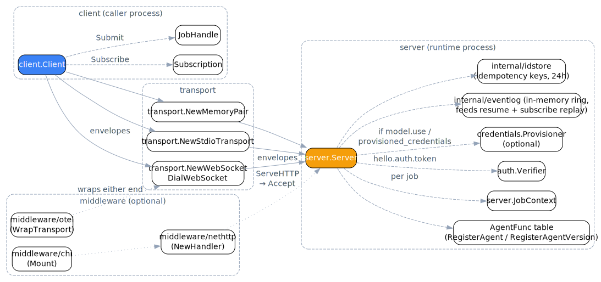

# ARCP Go SDK documentation

Reference docs for the [ARCP](../../spec/docs/draft-arcp-1.1.md) Go SDK.
The [top-level README](../README.md) is the front door; these pages go
deeper into the runtime, client, transports, packages, and conformance
surface.

<picture>
  <source media="(prefers-color-scheme: dark)" srcset="./diagrams/architecture-dark.svg">
  
</picture>

## Start here

- [Getting started](./getting-started.md) - install, build a runtime and client, run a job.
- [Architecture](./architecture.md) - how the Go packages fit together.
- [Transports](./transports.md) - WebSocket, stdio, and in-memory transports.
- [CLI](./cli.md) - the `arcp` binary in `cmd/arcp`.

## Guides

| Page | Spec |
| --- | --- |
| [Sessions](./guides/sessions.md) | §6 |
| [Resume](./guides/resume.md) | §6.3 |
| [Authentication](./guides/auth.md) | §6.1 |
| [Jobs](./guides/jobs.md) | §7 |
| [Job events](./guides/job-events.md) | §8 |
| [Leases](./guides/leases.md) | §9 |
| [Delegation](./guides/delegation.md) | §10 |
| [Observability](./guides/observability.md) | §8.2, §11 |
| [Errors](./guides/errors.md) | §12 |
| [Vendor extensions](./guides/vendor-extensions.md) | §5, §15 |

## Packages

| Package | Page |
| --- | --- |
| `go-sdk` | [packages/errors](./packages/errors.md) |
| `client` | [packages/client](./packages/client.md) |
| `server` | [packages/server](./packages/server.md) |
| `transport` | [packages/transport](./packages/transport.md) |
| `messages` | [packages/messages](./packages/messages.md) |
| `auth` | [packages/auth](./packages/auth.md) |
| `credentials` | [packages/credentials](./packages/credentials.md) |
| `middleware/nethttp` | [packages/middleware-nethttp](./packages/middleware-nethttp.md) |
| `middleware/chi` | [packages/middleware-chi](./packages/middleware-chi.md) |
| `middleware/otel` | [packages/middleware-otel](./packages/middleware-otel.md) |
| `cmd/arcp` | [packages/cmd](./packages/cmd.md) |

## Reference

- [Recipes](./recipes.md) - runnable solutions to common protocol patterns.
- [Conformance](./conformance.md) - summarized spec coverage with a link to the authoritative matrix.
- [Troubleshooting](./troubleshooting.md) - error codes, negotiation misses, and runtime fixes.

## Diagrams

Architecture diagrams use light/dark SVGs through GitHub's `<picture>`
element. Sources and rendered assets live in [diagrams](./diagrams/).
