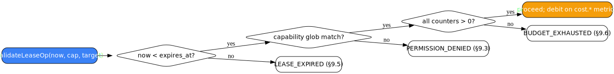

# Leases (§9)

<picture>
  <source media="(prefers-color-scheme: dark)" srcset="../diagrams/lease-and-budget-enforcement-dark.svg">
  
</picture>

A lease maps capability namespaces to glob patterns. The reserved
capabilities are constants on the `arcp` root package:

| Constant | Namespace |
| --- | --- |
| `arcp.CapFSRead` | `fs.read` |
| `arcp.CapFSWrite` | `fs.write` |
| `arcp.CapNetFetch` | `net.fetch` |
| `arcp.CapToolCall` | `tool.call` |
| `arcp.CapAgentDelegate` | `agent.delegate` |
| `arcp.CapModelUse` | `model.use` |
| `arcp.CapCostBudget` | `cost.budget` |

```go
lease := arcp.Lease{
    arcp.CapNetFetch:      {"https://api.example.com/**"},
    arcp.CapToolCall:      {"search.*"},
    arcp.CapAgentDelegate: {"summarizer@*"},
    arcp.CapModelUse:      {"tier-fast/*"},
    arcp.CapCostBudget:    {"USD:5.00"},
}
```

Agents validate operations through `JobContext.ValidateLeaseOp` before
the runtime or tool performs the action. The runtime checks expiry
first, then capability glob match, then budget counters:

```go
if err := jc.ValidateLeaseOp(arcp.CapModelUse, "tier-fast/gpt-4o-mini"); err != nil {
    return nil, err
}
```

Errors are one of `LEASE_EXPIRED`, `PERMISSION_DENIED`, or
`BUDGET_EXHAUSTED`, all carrying `retryable: false`.

## `model.use` (§9.7)

`model.use` grants access to model profiles or upstream model names.
Patterns are globbed like other lease targets and are intentionally
not canonicalized. Use it when the runtime is in the path of LLM
invocation. A miss returns `PERMISSION_DENIED`.

## Expiration and budgets

`LeaseConstraints.ExpiresAt` ends the lease at a fixed UTC time. The
runtime emits `LEASE_EXPIRED` if the timer fires while the job is
running.

`cost.budget` uses entries shaped `CUR:decimal` per the spec grammar.
Currency must be uppercase A–Z, all-lowercase, or the reserved
`"credits"`. Negative values are rejected at parse time. The runtime
debits matching counters on every `Metric` whose name starts with
`cost.` and whose `unit` matches a budgeted currency, and emits a
`cost.budget.remaining` follow-up metric on meaningful drawdown
(>5% of initial budget, or remaining at zero).

```go
amt, err := arcp.ParseBudgetAmount("USD:5.00") // {Currency: "USD", Value: 5.0}
_ = amt.String()                                // "USD:5"
```

## Provisioned credentials (§9.8)

Configure `server.Options.Provisioner` to mint credentials after the
lease is finalized:

```go
srv := server.New(server.Options{
    Provisioner: credentials.NewMemory("cred-"),
})
```

`NewMemory` takes the credential id prefix. When the client
negotiates `provisioned_credentials` (and `model.use`, which is gated
on the same provisioner), `job.accepted` includes `Credentials`. Each
credential carries its ID, scheme, secret value, endpoint, and
constraints derived from `cost.budget`, `model.use`, and
`expires_at`.

The runtime revokes attached credentials on every terminal state
(with bounded-retry backoff) and exposes `JobContext.RotateCredential`
for mid-job rotation, which fires a reserved `status` event with
`phase: "credential_rotated"`.

## Subset checking

For delegation (and any place you want to verify one lease is a
subset of another), use the public helper:

```go
err := arcp.IsLeaseSubset(parentLease, childLease, parentRemaining, parentExpiry, childExpiry)
```

A non-nil return is always `*arcp.Error` with code
`LEASE_SUBSET_VIOLATION`. See [Delegation](./delegation.md) for the
current limitation that no public API mediates child-job submission
yet.
